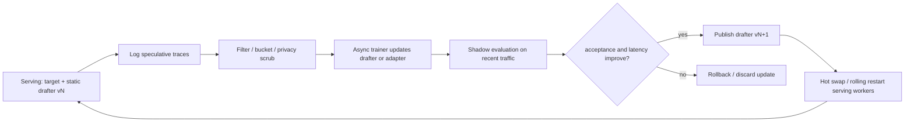

# 推理时在线更新投机头权重调研

调研日期：2026-06-03

## 0. 结论先行

针对“EAGLE-3、DFlash 这类投机头在推理框架接到用户请求后，能否持续更新自身权重，以提高后续请求的接受率和推理加速”这个问题，结论可以分三层：

1. **研究上已经有相关方向**，并且不只是概念。代表工作包括 ICML 2024 的 OSD、2026 年的 OnlineSpec、TIDE、TTS/Test-Time Speculation，以及更接近训练流程改进的 Draft-OPD、DistillSpec。这些工作都在不同程度上利用推理或 speculative verification 过程中产生的数据来更新 draft model / drafter。

2. **主流生产推理框架里，目前还没有形成“像加载静态 EAGLE-3/DFlash 权重一样，直接开启 live online training”的成熟通用功能**。vLLM、SGLang、Speculators/AngelSlim 当前更主流的形态仍是：先训练或继续训练 drafter，再作为静态权重加载到服务进程中。AngelSlim/Speculators 文档里的 “online training” 是训练阶段在线跑 target model 生成 hidden states，不等价于 vLLM 对外 serving 时边服务边原地更新权重。TIDE 已明确朝 serving-engine-native 在线适配迈进，但还不能等同于 vLLM 主线的通用开关。

3. **方案可行，但最佳落地点大概率不是“每个请求同步反向传播并立刻改当前服务权重”**，而是异步闭环：服务进程记录 accepted/rejected、target logits/hidden states、draft proposal 等训练信号，后台小步更新投机头或 adapter，经过影子评估后热切换到下一版本。这样可以保持 lossless speculative decoding 的正确性，同时降低吞吐抖动、CUDA graph 失效、并发一致性、模型污染和多租户隐私风险。

如果目标是实际落地，我建议从 **DFlash/EAGLE-3 的 “在线数据采集 + 后台微调 + 周期性热更新”** 做起，而不是一开始就把 optimizer 放进 vLLM worker 主循环。预期收益在强分布漂移、有稳定重复流量的场景更明显；在高度异构或低 QPS 场景，收益可能被训练开销、版本切换和过拟合抵消。

## 1. 背景：为什么接受率是瓶颈

Speculative decoding 的核心是：小的 draft model / 投机头先提出多个 token，再由 target LLM 并行验证。只要 verifier 按目标模型分布严格校验，最终输出仍与 target model 等价；加速主要来自每一轮验证能接受多少 draft token。

EAGLE-3、DFlash、DFlare 等方法把 draft 质量做得很强，但它们通常仍依赖一个已经训练完成的 drafter。服务上线后，如果真实用户请求分布偏离训练数据，例如行业术语、代码库私有风格、固定模板、企业客服话术、某些长推理题型，投机头的 accepted length 会下降，速度收益随之缩水。

这自然引出在线学习问题：既然 verifier 已经在推理时告诉我们哪些 draft token 被接受、哪些被拒绝，能否把这些信号反过来训练投机头？

## 2. 已有相关工作

### 2.1 OSD: Online Speculative Decoding

论文：OSD: Online Speculative Decoding，ICML 2024。链接：[arXiv 2310.07177](https://arxiv.org/abs/2310.07177)，代码：[LiuXiaoxuanPKU/OSD](https://github.com/LiuXiaoxuanPKU/OSD)。

OSD 是最直接对应本问题的早期工作之一。它观察到 speculative decoding 过程中会自然产生 target model 的标签，因此可以边推理边更新 draft model。作者的目标是解决 offline draft training 与实际推理分布不一致的问题。

关键点：

- 用 target LLM 在 speculative verification 中产生的监督信号在线更新 draft model。
- 论文报告 acceptance rate 相对基线提高约 0.1 到 0.65，latency speedup 可达约 1.42x 到 2.17x。
- 适合说明“推理时更新 draft model”在算法上可行。

局限：

- 论文时代的 draft model 形态与今天 EAGLE-3/DFlash 投机头不完全相同。
- 更像研究原型，不是 vLLM/SGLang 生产 serving 的通用能力。
- 对并发、热切换、模型版本一致性、多租户隔离等生产问题覆盖有限。

### 2.2 OnlineSpec: theory for online speculative decoding

论文：When Drafts Evolve: Online Speculative Decoding for Offline Models。链接：[arXiv 2603.12617](https://arxiv.org/abs/2603.12617)。

OnlineSpec 从理论角度刻画在线 speculative decoding。它把用户请求分布可能变化、draft model 需要逐步适应的场景形式化，并给出在线算法和 regret 分析。

关键点：

- 关注没有事先为目标分布训练好 drafter 的情况。
- 每次交互后，系统根据 target model 反馈更新 draft model。
- 论文摘要报告 token 开销最多降低约 24%。

价值：

- 说明“在线更新 drafter”不仅是工程直觉，也可以被放进 online learning 框架分析。
- 对动态请求分布、未知任务分布特别相关。

局限：

- 更偏理论与算法框架。
- 距离 EAGLE-3/DFlash 这类 hidden-state drafter 的生产落地仍需工程转换。

### 2.3 TIDE: Temporal Incremental Draft Engine

论文：TIDE: Inference-Time Policy Optimization for Efficient Speculative Decoding。链接：[arXiv 2602.05145](https://arxiv.org/abs/2602.05145)。相关介绍：[Moreh blog](https://moreh.io/blog/tide-self-improving-llm-inference-dynamic-speculative-decoding/)，[Hugging Face paper page](https://huggingface.co/papers/2602.05145)。

TIDE 是目前最接近“推理引擎内自我改进”的方向之一。它把 inference-time policy optimization 用到 speculative decoding：通过 accepted / rejected token 的反馈，在推理过程中动态优化 draft model。

关键点：

- 明确提出 inference-time policy optimization，而不是只在离线数据上蒸馏。
- 使用 lightweight 策略梯度式更新，利用 verifier 的接受/拒绝信号。
- 相关介绍称在 SGLang 和 SpecForge 环境中做过集成或验证，并报告相对静态 drafter 的吞吐提升。

价值：

- 与用户问题高度重合：不是只训练前适配，而是推理期间让 draft policy 变好。
- 工程叙事比 OSD 更接近现代 serving 系统。

局限：

- 截至本次调研，还没有看到 vLLM 主线里类似 `--enable-online-drafter-update` 的成熟通用开关。
- 需要进一步核实其开源代码、PR 合入状态、支持的模型结构，以及是否支持 EAGLE-3/DFlash 这类投机头，而不只是独立 draft model。

### 2.4 TTS: Test-Time Speculation

论文：Test-Time Speculation。链接：[arXiv 2605.09329](https://arxiv.org/abs/2605.09329)。

TTS 的核心是测试时在线蒸馏。它观察到包括 DFlash、EAGLE-3、PARD 在内的 speculator 在长输出中 acceptance length 会随生成长度下降，甚至接近 1；原因之一是离线训练序列较短，而推理时要匹配更长输出分布。因此它在推理过程中对 drafter 做持续适配。

关键点：

- 引入 test-time online distillation。
- 用推理阶段的反馈改善 draft model 与 target model 的匹配。
- 与“在线更新投机头”在目标上接近。
- 论文摘要报告相对强 speculator 的 acceptance length 最高提升 72%，平均提升 41%，且长输出越明显。

局限：

- 需要进一步看完整实验和代码支持情况。
- 是否能直接嫁接到 EAGLE-3/DFlash hidden-state head，还需要实现验证。

### 2.5 Draft-OPD: On-Policy Distillation for Speculative Draft Models

论文：Draft-OPD: On-Policy Distillation for Speculative Draft Models。链接：[arXiv 2605.29343](https://arxiv.org/abs/2605.29343)。本地已有中文总结：[papers/2605.29343_Draft-OPD_中文总结.md](../papers/2605.29343_Draft-OPD_中文总结.md)。

Draft-OPD 不是严格的“线上服务时持续更新”，但它对落地非常有参考价值。它指出静态 SFT drafter 的问题来自 offline-to-inference mismatch：训练时看到的是 target-generated trajectory，而真实 speculative decoding 时，drafter 会把自己带到 draft-induced states，错误位置很关键。

关键点：

- 用 target-assisted rollout 收集 speculative verification 中的 anchor/error positions。
- replay draft proposal，并让 target model 对 accepted 与 rejected token 都打分。
- 对 accepted/rejected token 采用不同 KL 目标，提高 accepted length。
- 本地总结中记录的实验结论显示，它能在 DFlash-style draft 上带来 accepted length 和 serving throughput 提升。

价值：

- 非常适合作为“后台在线再训练”的 loss 设计参考。
- 比单纯拿用户输出做 SFT 更贴近 speculative decoding 的真实瓶颈。

局限：

- 它仍更像训练/再训练流程，而不是服务进程内即时更新。

### 2.6 DistillSpec / 静态蒸馏类方法

论文：DistillSpec: Improving Speculative Decoding via Knowledge Distillation。链接：[arXiv 2310.08461](https://arxiv.org/abs/2310.08461)。

DistillSpec 代表了一类通过知识蒸馏改善 draft model 的方法。它不是在线推理时更新，但说明提升 draft-target 对齐可以显著改善 speculative decoding 效率。

价值：

- 可作为在线更新 loss 的基础。
- 与 Draft-OPD、TIDE 等相比，它更偏离线。

## 3. 推理框架现状

### 3.1 vLLM / SGLang 主流形态

vLLM、SGLang 等推理框架支持 speculative decoding 的主线能力，通常是加载 target model 和 draft model / speculative model，然后在 serving 时使用静态权重做 draft + verify。

vLLM 的 speculative decoding 文档和博客持续扩展 EAGLE、Medusa、n-gram、Speculators 等能力，例如：

- vLLM speculative decoding 文档：[docs.vllm.ai](https://docs.vllm.ai/en/latest/features/spec_decode.html)
- vLLM Speculators v0.5 博客：[vLLM blog 2026-05-28](https://vllm.ai/blog/2026-05-28-speculators-v050)
- vLLM Speculators v0.3 博客：[vLLM blog 2025-12-13](https://blog.vllm.ai/2025/12/13/speculators-v030.html)

但这些资料的重点是训练、支持更多 drafter、部署静态 drafter、提升吞吐和兼容性；不是在一个已经上线的 serving worker 中持续反向传播更新 drafter 权重。

### 3.2 AngelSlim / Speculators 的 “online training” 需要区分

本地代码与文档中有 `train_eagle3_online.py`、`train_dflash_online.py`，以及 DFlare 文档里的 “Online training”。它们的含义是：

- 训练过程中实时运行 target model，生成 hidden states 或训练信号。
- 相比 offline training，不需要预先把 hidden states 全部落盘。
- 训练完成后仍得到一个静态 checkpoint，再由 vLLM/SGLang 加载推理。

这不是“用户请求进来后，服务进程持续更新投机头权重”。本地可参考：

- `AngelSlim/tools/train_eagle3_online.py`
- `AngelSlim/tools/train_dflash_online.py`
- `AngelSlim/docs/source/features/speculative_decoding/dflare.md`
- `AngelSlim/docs/source/features/speculative_decoding/eagle/eagle.md`

### 3.3 目前可认为的成熟度分级

| 类型 | 代表 | 是否在线更新权重 | 是否生产框架成熟功能 | 对本问题价值 |
|---|---|---:|---:|---|
| 静态投机头 | EAGLE-3、DFlash、DFlare | 否 | 高 | 当前主流 baseline |
| 训练阶段在线 hidden-state 生成 | AngelSlim/Speculators online training | 是，但在训练期 | 中到高 | 训练效率与数据闭环 |
| 离线/准在线 on-policy 再训练 | Draft-OPD、DistillSpec | 训练/再训练期 | 中 | loss 和数据采样很有参考 |
| 推理期在线适配研究 | OSD、OnlineSpec、TIDE、TTS | 是 | 低到中 | 直接回答“有没有相关工作” |
| 推理框架原生 live update | vLLM/SGLang 通用开关 | 未见成熟通用形态 | 低 | 需要自研或二次开发 |

## 4. 如果要落地，推荐架构

### 4.1 不推荐的形态：同步请求内更新

同步形态指每个请求生成时，服务 worker 一边 draft/verify，一边对投机头做 backward/optimizer step，并立刻影响同一批或下一批 token。

问题：

- 会显著打断 continuous batching。
- backward 与 optimizer step 会抢占推理 GPU 资源。
- CUDA graph、静态 shape 优化、权重量化和 tensor parallel 通信都会变复杂。
- 同一批请求可能看到不同版本的 draft 权重，排查性能和复现实验会很困难。
- 用户请求可能带来投机头污染或隐私泄露。

### 4.2 推荐的形态：异步在线闭环

建议架构如下：

服务阶段需要记录的信号：

- prompt hash、任务/租户/路由标签、时间窗口。
- draft proposal token block。
- verifier 接受长度、accepted/rejected token 位置。
- target logits 或 top-k logits，至少需要在 draft proposal 位置上有监督信号。
- 对 EAGLE-3/DFlash，最好记录 target hidden states 或能重放生成 hidden states 的请求上下文。
- latency、tokens/s、GPU util、batch size 等系统指标。

训练阶段可选策略：

- **低风险版本**：只训练小 adapter/LoRA/head projection，不改完整 drafter。
- **中风险版本**：按流量窗口微调整个投机头，每隔 N 分钟或 N 万 token 发布新版本。
- **高风险版本**：服务 worker 内做轻量 optimizer step，只适合研究或非常小的 head/adaptor。

### 4.3 对 EAGLE-3 的适配思路

EAGLE-3 依赖 target model hidden states 与 token embedding，投机头通常较小。在线更新可采用：

- 使用 verifier 过程中的 target hidden states 作为输入。
- 对 accepted token 做正向 KL / CE，鼓励 drafter 匹配 target。
- 对 rejected token 做更强的校正，可参考 Draft-OPD 的 accepted/rejected 区分。
- 保留一个全局 base head，加一个按领域/租户/任务路由的 adapter。

优点：

- head 小，更新成本相对可控。
- hidden states 来自 target model，监督信号质量高。

难点：

- vLLM serving 是否方便暴露中间 hidden states。
- hidden-state 抽取会增加 target forward 的内存与带宽压力。
- 不同模型层、不同 EAGLE-3 配置的特征对齐要稳定。

### 4.4 对 DFlash / DFlare 的适配思路

DFlash/DFlare 是 block-parallel drafter，一次预测一个 block，再由 target 并行验证最长可接受前缀。

可使用：

- 每个 block 的 anchor position。
- 每个 proposal block 的 accepted prefix length。
- rejected suffix 的 target scoring。
- 按位置衰减的 rejected-token loss，避免错误前缀污染后的 suffix 过度主导训练。

这与 Draft-OPD 的思想高度契合。DFlash/DFlare 的在线更新不一定要每轮立即训练，可以把一段时间内的 anchor/replay 样本聚合起来做后台 OPD。

优点：

- block accepted length 是非常直接的优化指标。
- 训练信号和服务指标天然对齐。

难点：

- block-parallel drafter 的 loss 和 mask 更复杂。
- 更容易出现“为了最近流量提高接受率，但泛化下降”的问题。
- 如果线上流量混合了数学、代码、闲聊、工具调用，单一在线 head 可能互相干扰。

## 5. 正确性与安全性

从理论上，只要 speculative verification 是严格 lossless 的，draft model 可以任意变化，最终输出分布仍由 target model 决定。在线更新投机头一般不会改变最终语义质量，只改变接受率和速度。

但实际系统中仍有风险：

- 如果用了近似 verifier、lossy speculative decoding、top-k 截断验证，draft 更新可能影响输出质量。
- 如果记录用户请求和 target logits，需要隐私合规与数据保留策略。
- 恶意流量可能 poison drafter，使其他用户的接受率下降。
- 多租户共享更新会把一个租户的数据分布泄露到另一个租户的性能行为中。
- 热更新需要版本隔离，否则性能回归难以定位。

最低要求：

- 每个 drafter version 记录训练窗口、数据来源、loss、offline acceptance、shadow traffic acceptance、latency。
- 有自动 rollback 条件：accepted length、tokens/s、P99 latency、OOM、错误率任一恶化则回滚。
- 对高价值客户或高风险场景使用 per-tenant adapter 或 opt-in 数据策略。

## 6. 预期收益分析

### 6.1 收益来源

在线更新投机头的收益主要来自三类场景：

1. **稳定但与训练集不同的领域流量**：企业客服、法律/金融术语、内部代码库、固定文档格式。
2. **短期热点分布**：某个新 API、某个新产品发布、某类重复问题突然增多。
3. **长会话或多轮任务**：同一任务内部语言模式重复，后续 token 更容易被适配后的 drafter 捕捉。

### 6.2 收益上限

粗略看，速度收益受三件事限制：

- drafter 本身成本占比。
- target verification batch 并行效率。
- accepted length 的边际提升。

如果静态 DFlash 已经达到很高 accepted length，在线更新的边际收益可能只有几个百分点到十几个百分点。Draft-OPD 这类 on-policy 再训练报告的 serving throughput 提升大致也在这个量级。若原始 drafter 在真实分布上明显失配，OSD/TIDE/OnlineSpec 类方法报告的提升可能更大。

### 6.3 什么时候不值得

以下场景不建议优先做 live online update：

- 请求分布极其分散，没有足够重复模式。
- QPS 低，积累不到稳定训练窗口。
- 线上 GPU 已经被推理打满，无法承受训练干扰。
- 服务强多租户，无法共享训练信号。
- 已有静态 DFlash/DFlare 的 accepted length 很高，瓶颈转移到调度、KV cache、网络或 tokenizer。

## 7. 建议的 POC 路线

### 阶段 1：只做在线日志与离线回放

目标：先证明真实流量上存在可学习的 acceptance gap。

做法：

- 在 benchmark 或 shadow traffic 中记录 draft proposal、accepted length、rejected positions。
- 对流量按任务类型分桶，统计 accepted length 分布。
- 离线用 Draft-OPD/TIDE 风格 loss 更新一个 adapter。
- 在 holdout traffic 上验证 accepted length 和 end-to-end latency。

成功标准：

- 最近流量桶 accepted length 提升超过 5%。
- wall-clock tokens/s 有可观提升，且 P99 latency 不恶化。
- 泛化 holdout 不下降，或可通过路由 adapter 隔离。

### 阶段 2：后台异步训练 + 周期性热更新

目标：服务不中断地更新 drafter version。

做法：

- trainer 与 serving 分离。
- 每 10 到 60 分钟或每若干百万 token 训练一个新 adapter。
- shadow evaluation 通过后滚动发布。
- 支持自动 rollback。

成功标准：

- 连续多个发布周期 accepted length 稳定提升。
- 线上吞吐提升能覆盖训练成本。
- 没有明显版本抖动。

### 阶段 3：更细粒度在线适配

目标：探索 per-domain、per-tenant、per-session adapter。

做法：

- 路由多个 lightweight adapter。
- 对强重复场景尝试 session-local adapter 或缓存式 n-gram + neural drafter 混合。
- 引入 bandit/online learning 控制何时启用哪个 drafter。

成功标准：

- 异构流量中比单一全局 online head 更稳定。
- 不同租户或任务之间没有负迁移。

## 8. 与当前本地 AngelSlim 代码的关系

本地仓库已经具备很好的基础：

- 有 EAGLE-3/DFlash/DFlare 训练入口。
- 有 online training 与 offline training 两套路径。
- 有 vLLM benchmark 脚本。
- 有 DFlash/DFlare block accepted length 统计能力。

但若要实现“服务期在线更新”，还需要新增：

- serving trace logger：记录 speculative verification 过程中的 accepted/rejected 信号。
- replay dataset builder：把线上 trace 转为 Draft-OPD/TIDE 风格训练样本。
- async trainer：支持从当前 checkpoint 或 adapter 继续小步训练。
- version publisher：输出新 drafter/adaptor。
- serving hot swap：vLLM/SGLang worker 加载新版本或滚动重启。
- shadow evaluator：自动评估新版本是否真正提升真实流量 acceptance。

因此，本地项目可以作为 POC 起点，但不是开箱即用的 live online learning serving 框架。

## 9. 最终判断

如果问题是“学术上有没有人在做推理时在线更新投机头 / draft model？”答案是：**有，而且方向正在变热**。OSD、OnlineSpec、TIDE、TTS 都是直接相关工作；Draft-OPD 虽不完全是 serving-time live update，但给出了非常适合 EAGLE-3/DFlash 的 on-policy 训练范式。

如果问题是“vLLM 这类生产推理框架是否已经成熟支持接请求后持续更新 EAGLE-3/DFlash 权重？”答案是：**尚未看到成熟、通用、主线化的实现**。目前更现实的落地方式是在线采集 + 后台再训练 + 周期性热更新。

从可行性看，方案成立；从工程收益看，值得在分布漂移明显、流量重复度高、静态投机头接受率偏低的场景做 POC。预期收益不宜一开始按数倍提升估计，更合理的目标是：先拿到 5% 到 20% 的 accepted length 或吞吐提升；只有当当前投机头与真实流量严重失配时，才可能出现更大的收益。

## 参考资料

- OSD: Online Speculative Decoding, ICML 2024: https://arxiv.org/abs/2310.07177
- OSD code: https://github.com/LiuXiaoxuanPKU/OSD
- When Drafts Evolve: Online Speculative Decoding for Offline Models: https://arxiv.org/abs/2603.12617
- TIDE: Inference-Time Policy Optimization for Efficient Speculative Decoding: https://arxiv.org/abs/2602.05145
- Moreh TIDE blog: https://moreh.io/blog/tide-self-improving-llm-inference-dynamic-speculative-decoding/
- TTS: Test-Time Speculation: https://arxiv.org/abs/2605.09329
- Draft-OPD: On-Policy Distillation for Speculative Draft Models: https://arxiv.org/abs/2605.29343
- DistillSpec: Improving Speculative Decoding via Knowledge Distillation: https://arxiv.org/abs/2310.08461
- vLLM speculative decoding docs: https://docs.vllm.ai/en/latest/features/spec_decode.html
- vLLM Speculators v0.5 blog: https://vllm.ai/blog/2026-05-28-speculators-v050
- AngelSlim local docs and code: `AngelSlim/tools/train_eagle3_online.py`, `AngelSlim/tools/train_dflash_online.py`, `AngelSlim/docs/source/features/speculative_decoding/dflare.md`
